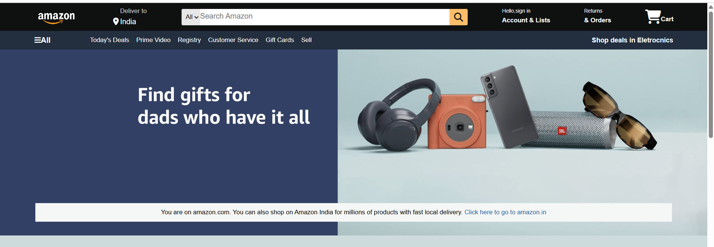
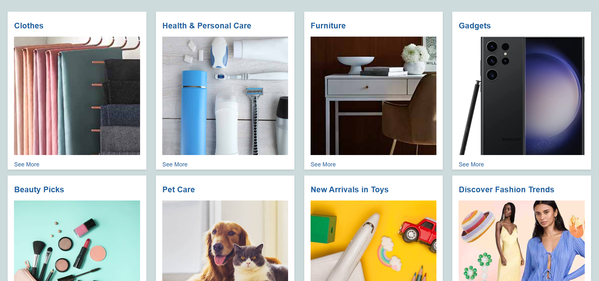
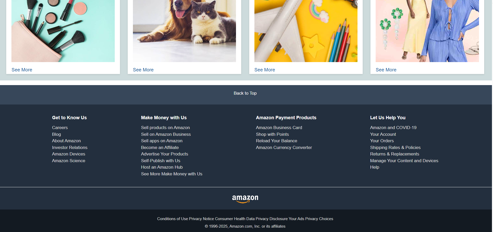

#  Amazon Clone (HTML & CSS Only)

This is my **first web development project**, a clone of the Amazon homepage built using only **HTML and CSS**.  
The project helped me practice **layout design, flexbox, hover effects, background images, and footer styling**.

---

## 🚀 Features
- ✅ **Navigation Bar** with logo, location, search bar, sign-in, returns, and cart  
- ✅ **Panel Section** with quick links and deals  
- ✅ **Hero Section** with background image and overlay message  
- ✅ **Shop section** displaying product categories
- ✅ **Footer** with back-to-top button, useful links,and copyright  

---

## 📸 Project Preview

### Homepage


### Product Categories


### Footer


---

## 🛠️ Technologies Used
- **HTML5**
- **CSS3 (Flexbox, Box Model, Hover Effects)**

---

## 📂 Project Structure

Amazon-Clone/
│── index.html
│── style.css
│── assets/
│ └── images used in project
│── project-preview/
│ └── screenshots of project
│── README.md


---

## 📌 How to Run
1. Clone this repository  
   ```bash
   git clone https://github.com/samiksha-d-20/amazon-clone.git


2. Open the project folder
   cd amazon-clone

3. Run the project by opening index.html in any browser

---
## ✨ Author
👩‍💻 Created by **Samiksha Desai**  
📌 Part of my frontend development journey
